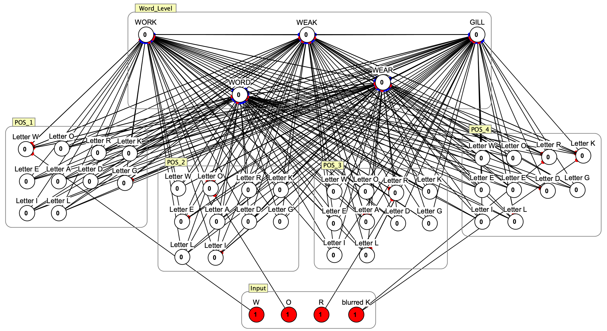
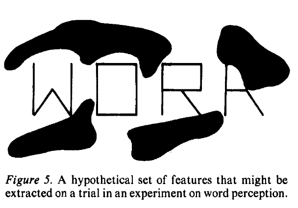
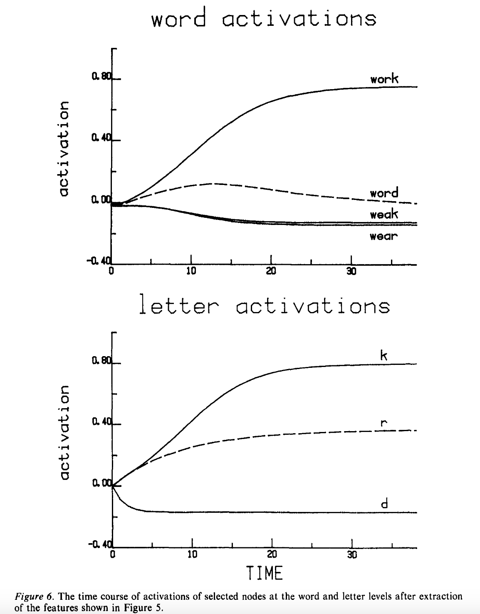

# IA-1981 IAC Letter Perception (Simbrain workspace)

> A minimal, runnable replication of the classic **Interactive Activation** (IA) model demonstration in McClelland & Rumelhart (1981), focusing on the “WORK” example (word superiority effect).

- **Simulator**: [Simbrain](https://simbrain.net) • Source: [github.com/simbrain/simbrain](https://github.com/simbrain/simbrain)
- **Version used here**: Simbrain 3.07, Mac (Apple Silicon)
- **Workspace**: `workspaces/IA(1981)_LetterPerception_WORK_demo.zip`  
  Open this zip directly in Simbrain (no need to unzip).

---

## Preview

---
## How to run

1. **Install Simbrain**  
   Download from the official site: <https://simbrain.net>
- Note:
    This demo was built and tested with Simbrain 3.07, Mac (Apple Silicon), but
    should also work with the corresponding Intel / Windows / Linux builds of 3.07.

2. **Open the workspace**  
- Start Simbrain
- Choose File → Open Workspace (.zip)
- Select: *workspaces/IA(1981)_LetterPerception_WORK_demo.zip*

3. **Run the simulation**
- Press the Run / Play button to let the network iterate.

4. **Observe the dynamics**  
- At the word level, the node for WORK becomes strongly active, while
competitors (WEAK, WEAR, GILL) remain suppressed.
- 
- At the letter level, letters consistent with the word and position show
higher activation, reproducing the word superiority effect qualitatively
similar to Fig. 6 in the paper.

## Notes on parameters

All connection weights and parameters in this workspace strictly follow the
values and descriptions given in McClelland & Rumelhart (1981).

   

**Note**: Because letter–letter inhibition is zero, the activation time course of the
letter d in this implementation does not dip as far below zero. The overall qualitative pattern, however, matches the
original IA model description:
- 

  
  

If you wish to experiment with competition at the letter level, you can
set a letter–letter inhibition weight in Simbrain and rerun the
simulation.

---

## License

- All files in this repository (workspace, documentation, and images created for
this demo) are released under the MIT License (see LICENSE).

- Simbrain itself is distributed under its own license(s); please refer to:

  - Official website: https://simbrain.net

  - GitHub repository: https://github.com/simbrain/simbrain
---

## Citation

If you use this demo in your teaching or research, please cite at least:

- McClelland, J. L., & Rumelhart, D. E. (1981).
An interactive activation model of context effects in letter perception: Part 1.
An account of basic findings. Psychological Review, 88(5), 375–407.

and the Simbrain project:

- Simbrain project, https://simbrain.net

